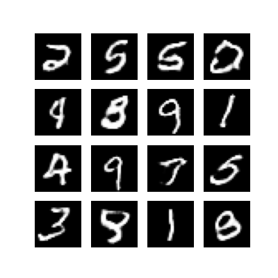
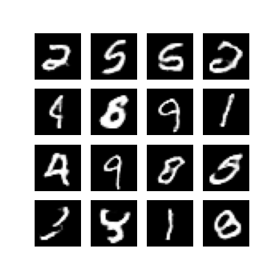

# 🧠 GAN for MNIST Digit Generation

This project implements a **Generative Adversarial Network (GAN)** using TensorFlow and Keras to generate handwritten digit images similar to those in the MNIST dataset. The model learns to generate realistic digits through adversarial training between a **Generator** and a **Discriminator**.

## 📌 Project Overview

- **Dataset:** MNIST — 28x28 grayscale images of handwritten digits (0-9)
- **Model:** Basic GAN (can be extended to DCGAN or Conditional GAN)
- **Framework:** TensorFlow + Keras
- **Output:** New images of digits generated from random noise

---

## 🧠 How GAN Works

A GAN consists of two neural networks:

- **Generator:** Takes random noise as input and generates fake digit images.
- **Discriminator:** Takes both real (from MNIST) and fake images, and tries to classify them correctly.

The two networks are trained simultaneously in a zero-sum game:
- The Generator tries to fool the Discriminator.
- The Discriminator tries not to be fooled.

---

## 🏗️ Model Architecture

### Generator

- Dense layers
- Batch Normalization
- Leaky ReLU
- Reshape to 28x28 image
- Sigmoid activation

### Discriminator

- Flatten + Dense layers
- Leaky ReLU
- Binary classification with Sigmoid

> The model can be upgraded to **DCGAN** by using convolutional layers instead of dense layers.


## 🔧 Setup Instructions

### 📁 Clone the Repository

```
git clone https://github.com/YOUR_USERNAME/GAN-MNIST.git](https://github.com/MohaYass92/GAN-for-MNIST-Digit-Generation
cd GAN-for-MNIST-Digit-Generation
```
⚙️ Install Dependencies
Use the following to install required libraries:

```
pip install tensorflow numpy matplotlib
```
If you're using Google Colab, most dependencies are already installed.

🚀 Running the Model
You can run the model in Google Colab or locally using the notebook provided.

## 📈 Training Results


### Example output after training for 80 epochs:


### Example output after training for 80 epochs:




### Example output after training for 80 epochs:




## 🔮 Possible Improvements :

✅ Replace dense layers with convolutional layers (DCGAN)

✅ Use Conditional GAN to generate specific digits (cGAN)

🔁 Add image saving and model checkpointing

📊 Add TensorBoard support for training visualization

🔍 Experiment with other datasets like Fashion-MNIST or CIFAR-10

## 📂 File Structure
```
├── gan_mnist.ipynb        # Main training notebook
├── README.md              # Project documentation
├── 80.png                 # Result image at 80 epoch
├── 90.png                 # Result image at 90 epoch
└── 100.png                # Result image at 100 epoch
```
## 🤝 Contributions
Contributions, pull requests, and improvements are welcome! Feel free to fork the repository and submit changes.

## 📜 License
This project is licensed under the MIT License.

## ✨ Acknowledgements

- Ian Goodfellow — Inventor of GANs
- TensorFlow & Keras Documentation
- The MNIST dataset by Yann LeCun


